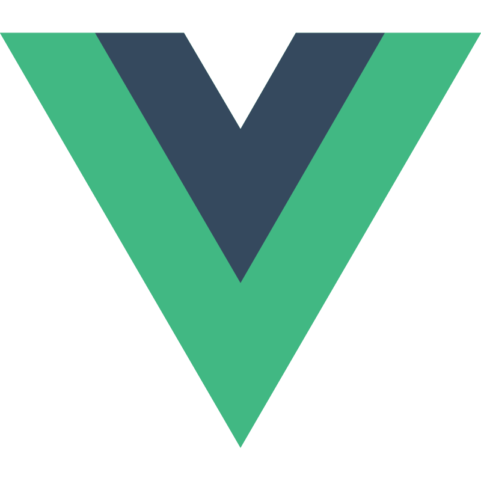
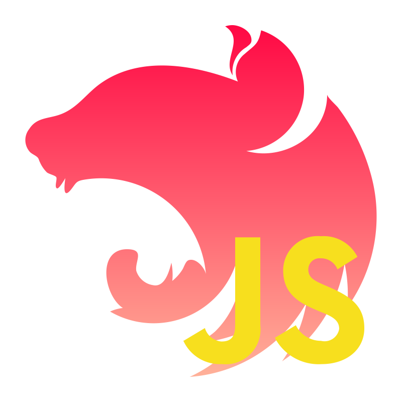
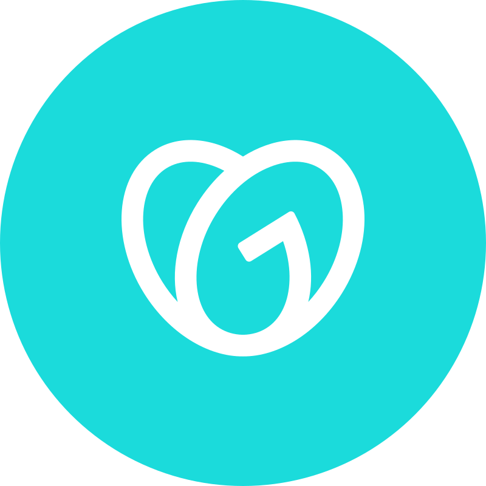

# Just Range In Over ⚡️

- 🖥️  Check our website at [rangein.io](rangein.io)
- ✉️  You can contact with us at [business@rangein.io](mailto:business@rangein.io)
- 🤝  We are open for cooperation in project work or partnership

### Skills

  

### Socials

 
  

